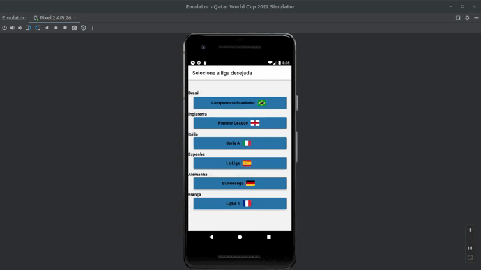

# Football Leagues

This app is build with **React Native** and **Expo**.

# About this Project

App built with react native to look for 6 major football (or soccer) national leagues in the world:

- Brazil: Campeonato Brasileiro
- England: Premier League
- Germany: Bundesliga
- Spain: La Liga
- Italy: Seria A
- France: Ligue 1

This app provides information about classification of all teams at a specific season and round. This app consumes the API provided by the guys of https://github.com/openfootball

# Getting Started

**Prerequisites**

To run this project, you'll need to have *npm* installed.

**Installing**

To install the npm, run this on terminal:

	$ sudo apt install nodejs
	$ sudo apt install npm
	
You also need to install expo on your system with:	
	
	$ npm install expo-cli --global
	
You can read the Expo documentation and install from [here](https://expo.dev/).

After that, clone this Repository:

    $ git clone https://github.com/awcasella/World-Cup-2022-Sinulator.git

You need to set a virtual (emulator on Android Studio) or physical smartphone device.

Change to the root directory of the project:
    
    $ cd Football-Leagues
    
And start the application with:

    $ expo start

**Reference**
- Football.db. Open Public Domain Football Datasets in (Structured) Text using the (Future-Proof & Evergreen) Football.TXT Format. Gerald Bauer.  Available at: [https://github.com/openfootball](https://github.com/openfootball). Access in November, 2022.
